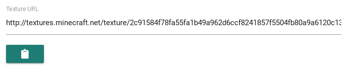
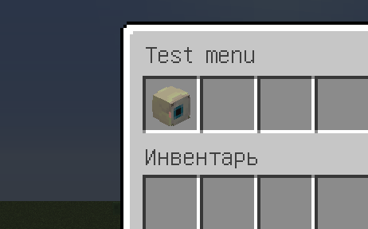

.. include:: ../_includes/datatypes.rst

Animations
==========

.. include:: ../_includes/contents.rst

Frame-by-frame animation
------------------------

Any menu with frame-by-frame animation should have a ``frames`` block in the root of the menu. If the menu has a ``frames`` block, the plugin will suppose this menu is animated. The frames block itself replaces the standard ``items`` block. Below are the parameters that can be specified in any animated menu, in addition to the standard.

.. csv-table::
	:header: "Name", "Data type", "Required", "Description"
	:widths: 5, 5, 10, 30

	"onAnimStart", |t_obj|, "No", "Actions before animation start"
	"onAnimEnd", |t_obj|, "No", "Actions after animation finished (won't work for looped animations)"
	"loop", |t_bool|, "No", "Loop the animation. By default is ``false``"
	"frames", |t_list_obj|, "Yes", "List of animation frames"

Below you can see an example of an empty menu, prepared for adding frames.

::

	title: "&eAnimated menu"
	size: 3
	activators {
	  command: "anim"
	}
	loop: true
	frames: [
	  {
	    # ... Here is some frame that we will add later
	  },
	  {
	    # ... Second frame
	  }
	]

Frame format
~~~~~~~~~~~~

The frame is a unit of animation. Each frame contains a list of buttons that will be placed in inventory, as well as additional useful parameters. Below is a table of parameters of any frame.

.. csv-table::
	:header: "Name", "Data type", "Required", "Description"
	:widths: 5, 5, 10, 30

	"delay", |t_int|, "No", "Delay in ticks before playing this frame. By default is ``20``"
	"clear", |t_bool|, "No", "Clear inventory before adding new frame items. By default is ``true``"
	"rules", |t_obj|, "No", "Rules for playing a frame"
	"onStart", |t_obj|, "No", "Actions **before** frame play"
	"onEnd", |t_obj|, "No", "Actions **after** frame play"
	"items", |t_list_obj|, "Yes", "List of items for this frame"

If the ``clear`` parameter set to ``false``, then when frame plays, items already in the inventory will not be deleted. This will allow you to slightly optimize both the load on the server and the size of the menu file.

In the ``items`` block, items has the same format as always, similarly to the usual menu items.

The minimum possible delay between frames is 1 tick.

If rules are specified for a frame, before playing the player will first be checked for compliance with these rules. If it does not match, the frame will be just skipped, and items from the previous frame will remain in the inventory.

Create simple animation
~~~~~~~~~~~~~~~~~~~~~~~

Now let's create a simple animation. We need the item in inventory to move from the left to the right corner. The example uses templates, but you can do it without them by simply copying all the parameters (not recommended). Our animation menu file will looks like this:

::

	title: "&lAnimation example"
	size: 1
	activators {
	  command: "menu"
	}
	frames: [
	  {
	    delay: 10
	    items: [
	      ${someItem} {slot: 0}
	    ]
	  },
	  {
	    delay: 10
	    items: [
	      ${someItem} {slot: 1}
	    ]
	  },
	  {
	    delay: 10
	    items: [
	      ${someItem} {slot: 2}
	    ]
	  },
	  {
	    delay: 10
	    items: [
	      ${someItem} {slot: 3}
	    ]
	  },
	  {
	    delay: 10
	    items: [
	      ${someItem} {slot: 4}
	    ]
	  },
	  {
	    delay: 10
	    items: [
	      ${someItem} {slot: 5}
	    ]
	  },
	  {
	    delay: 10
	    items: [
	      ${someItem} {slot: 6}
	    ]
	  },
	  {
	    delay: 10
	    items: [
	      ${someItem} {slot: 7}
	    ]
	  },
	  {
	    delay: 10
	    items: [
	      ${someItem} {slot: 8}
	    ]
	  }
	]

	someItem {
	  material: STONE
	  name: "&aHello!"
	}

In the game, it looks like this:

	Simple animation result

Here, our ``someItem`` item was placed in 9 different frames. In each next frame, we've set the item position to the next slot. Since the ``clear`` parameter was set to ``true`` by default, the inventory clears before each frame.

This is just the the simplest example of animation. If you wish, you can create truly complex and beautiful animations.

Head animation
--------------

The plugin allows you to create head animations using pre-created textures. Animation for the head can be created in two stages:

#. Create the head textures and add these textures as animation frames.
#. Add animations to the menu through a special placeholder.

.. important:: Head animations will only work if the menu has the ``updateInterval`` parameter. Each head frame plays along with a menu update.

Add head animation
~~~~~~~~~~~~~~~~~~

Each frame of the head animation is a separate head. To create an animation, you first need to generate each head (frame) for the animation. It is best to use the `MineSkin <https://mineskin.org>`_ service for this. After generation, you need to copy the link to the texture. The texture field is located as shown in the screenshot below.

	Texture field to copy

We need only the hash of the skin, without the address ``http://textures.minecraft.net/texture/``.

After we created frames, and saved all head textures, they can be added to the ``animated_heads.conf`` file, which is located in the plugin folder. Initially, this file already contains one animation that you can try just now. It is called ``anim_eye``.

To add your animation, create a :ref:`list of strings <hocon-list-str>` anywhere in the config, similar to the ``anim_eye`` block. Each next element in the list is the next frame. Head animation always looped. You should know it when you creating animation frames. After you've added all frames to the file, save it. The animation is created, now it needs to be added to the item.

Using added animation
~~~~~~~~~~~~~~~~~~~~~

Any item has a ``texture`` parameter. Thanks to a special placeholder, this parameter can be used in a new way. Example:

::

	items: [
	  {
	    slot: 0
	    texture: "%hanim_:anim_eye:1%"
	    name: "&aAnimated head"
	  }
	]

Here, in the ``texture parameter``, instead of a static texture, we added a special placeholder. It will be replaced with the texture of a specific frame during the menu update through ``updateInterval`` parameter. You can see an example of the animation below.

	Head animation example

The number ``1``, that was specified after the name of the animation, is necessary to identify this particular button. In one menu, each item with the same animation should have different identifiers. You can use any text, but we used just a number. If several buttons on the same menu and with one animation have the same identifier, a frames of the animation will not be displayed correctly.