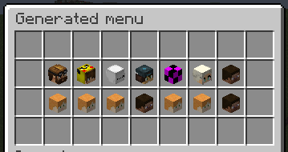

.. include:: ../_includes/datatypes.rst

Menu generator
==============

.. include:: ../_includes/contents.rst

Basics
------

Generated menu can be created in few steps:

#. Specify the catalog of objects. It can contain additional parameters for filtering objects, etc.
#. Create a matrix of cells, into which items from the catalog will be placed according to the template. The matrix should have as many rows as the menu itself.
#. Specify item templates. It is these items that the necessary placeholders from the catalog are indicated.
#. The generated menu might have several pages. Special actions can be used to navigate between them.

All catalogs are listed in the end of this page. Here we will show you how to create a simple generated menu. 
For example we will use the ``PLAYERS`` catalog, that generates a list of all players on the server.

::

	title: "Generated Menu"
	size: 4

	catalog {
	  type: PLAYERS
	}

	matrix {
	  cells: [
	    "_________",
	    "_xxxxxxx_",
	    "_xxxxxxx_",
	    "_________"
	  ]
	  templates {
	    "x" {
	      skullOwner: "%ctg_player_name%"
	      name: "&7Player &e%ctg_player_name%"
	    }
	  }
	}

Here we have created a menu with 4 rows. Once we have specified the ``catalog`` parameter, the plugin will assume that our menu is auto-generated.

:catalog: Catalog configuration. It always has ``type`` parameter. The ``type`` is a name of the catalog. It can also contains other parameters, depends on the catalog type.
:cells: This is a list of strings, represents a matrix of cells. Each line of this list is ​​a menu row. Each symbol in the line represents an inventory slot. The ``_`` character (or any other character that absent in the ``templates`` block) means an empty slot, that is, no item will be added to that slot. The ``x`` character is the tag which we added before. This means that only the item of the template ``x`` and no other item can be added to this inventory slot.
:templates: Binding items to some tag. Each matrix template must have its own tag. A tag is any Latin character from ``a`` to ``z``, or a special character. After we have created the tag, we can bind any item to it. Note you don't need to specify slot for item, since a slot is automatically computes while generating menu.

As a result, with enough players on the server, we will get menu looks like this:

	Example of generated menu

Switch pages
------------

The catalog can contain many objects, so the menu can be paginated when generates. To switch these pages, there is two special actions: ``pageNext`` and ``pagePrev``, which switch to the next or previous page respectively.

To add buttons for pages switching, you need to define a list of static buttons, as we would do in a simple menu. Example:

::

	title: "Generated menu"
	size: 4

	catalog {
	  type: PLAYERS
	}

	matrix {
	  cells: [
	    "_________",
	    "_xxxxxxx_",
	    "_xxxxxxx_",
	    "_________"
	  ]

	  templates {
	    "x" {
	      skullOwner: "%ctg_player_name%"
	      name: "&7Player &e%ctg_player_name%"
	    }
	  }
	}

	items: [
	  {
	    slot: 27
	    material: ARROW
	    name: "&e&l<<"
	    click {
	      pagePrev: 1
	    }
	  },
	  {
	    slot: 35
	    material: ARROW
	    name: "&e&l>>"
	    click {
	      pageNext: 1
	    }
	  }
	]

Here we have specified the static items with actions for switching the pages of the generated menu. These items will be displayed on all pages of the menu (until we specify some rules for their display). Thus, we can specify any static items in which placeholders from the catalog will also work.

Placeholders
------------

The important part of the auto-generated menus is a context placeholders. Each catalog uses one of the :ref:`Value Extractors <value-extractors>`. The usage of these extractor similar to how they uses for :ref:`Activators <input-how-to>`. The only difference is different prefix: ``ctg_``, and not ``activator_``.

During menu generation, placeholders are generated for each catalog's object and can be used almost anywhere in the menu.

Catalog placeholders looks like this:

::

	%ctg_<placeholder>%

Here ``ctg_`` is a prefix, short for ``catalog``. The ``<placeholder>`` is a specific placeholder from value extractor which catalog uses, or one of the common catalog's placeholders, which described in table below.

.. csv-table::
	:header: "Placeholder", "Type", "Description"
	:widths: 5, 5, 30

	"page", |t_int|, "Current page index"
	"pages", |t_int|, "Total amount of menu pages"
	"page_next", |t_int|, "Next page index"
	"page_prev", |t_int|, "Previous page index"
	"elements", |t_int|, "Total amount of catalog objects"

For example, to use the ``page`` placeholder from this list, you can write ``%ctg_page%``.

Catalogs
--------

A catalog is a dynamic collection of objects of the same type. Each catalog has its own unique name.
The catalog can also have additional parameters that you can specify in the same ``catalog`` block.

Each catalog provides own palceholders due one of the :ref:`Value Extractor <value-extractors>`. To know that placeholders you can use with some catalog, just look at the placeholders which provides extractor which catalog uses. Then just add ``ctg_`` prefix. These placeholders can be used in templates for generation. Below are the default catalogs currently available in AbstractMenus.

.. tip:: You can create your own catalogs, using an API.

.. note:: Catalog's placeholders will not work for static items inside ``items`` list. Because these items created and placed to inventory once before generating dynamic items.

Players
~~~~~~~

**Type**: ``PLAYERS``

**Extractor type**: :ref:`extractor-entity`

Returns all online players on the server. Since this catalog uses :ref:`extractor-entity` and all objects in provided collection are Players, you can use any regular placehodler with ``ctg_`` prefix when you use this catalog type. Example:

::

	catalog {
	  type: PLAYERS
	}

	matrix {
	  cells: [
	    "_________",
	    "_xxxxxxx_",
	    "_xxxxxxx_",
	    "_________",
	  ]
	  templates {
	    "x" {
	      skullOwner: "%ctg_player_name%"
	      name: "Player level is %ctg_player_level%"
	    }
	  }
	}

That is, after the ``ctg_`` prefix, we can write any placeholder (without the ``%`` chars), and this will be replaced in the context of the player from the catalog. 

In this case, we used ``player_name`` placeholder (it exists in PlaceholderAPI and bundled placeholders).

Worlds
~~~~~~

**Type**: ``WORLDS``

**Extractor type**: :ref:`extractor-world`

Returns all worlds of the server.

Entities
~~~~~~~~

**Type**: ``ENTITIES``

**Extractor type**: :ref:`extractor-entity`

Returns all entities of the player's world. Has an additional parameter to search for entities of a certain type only.

:allowedTypes: List of strings. If this parameter is specified, only entities of the specified types are returned. See all entity types `here <https://hub.spigotmc.org/javadocs/spigot/org/bukkit/entity/EntityType.html>`_

BungeeCord servers
~~~~~~~~~~~~~~~~~~

**Type**: ``BUNGEE_SERVERS``

**Extractor type**: *Own extractor. See placeholder below*

Returns all BungeeCord servers. Works only if ``bungeecord: true`` is set in the plugin configuration. This catalog uses own extractor with that placeholders:

.. csv-table::
	:header: "Placeholder", "Type", "Description"
	:widths: 5, 5, 30

	"server_name", |t_str|, "Server name"
	"server_online", |t_int|, "Amount of players on the server"

Iterator
~~~~~~~~

Type: ``ITERATOR``

**Extractor type**: *Own extractor. See placeholder below*

Returns a generated list of numbers from ``A`` to ``B``. Useful for generating an exact number of items from a template.

Has three parameters:

:start: *Number*. Start value (inclusive)
:end: *Number*. The final value (inclusive)
:desc: [Optional]. *Boolean*. If true, numbers will be generated in reverse order. That is if ``start`` is 1, and ``end`` is 10, then it will generate ``10, 9, 8, ..., 1``

Standard placeholders (not catalog placeholders) can be used for these parameters. This means that you can use, for example, the value of a variable.

This catalog uses own extractor with that placeholders:

.. csv-table::
	:header: "Placeholder", "Type", "Description"
	:widths: 5, 5, 30

	"index", |t_int|, "Current number"

So far, these are all available catalogs. In general, the catalog system is designed for independent expansion by the user to suit his needs. Despite, we will modify and add new catalogs over time.