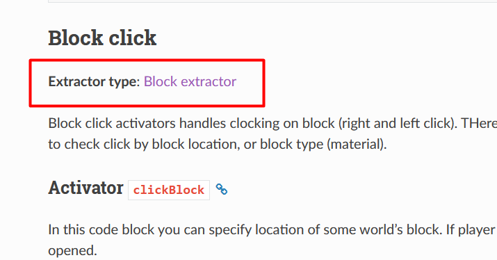
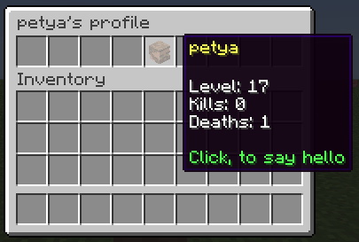
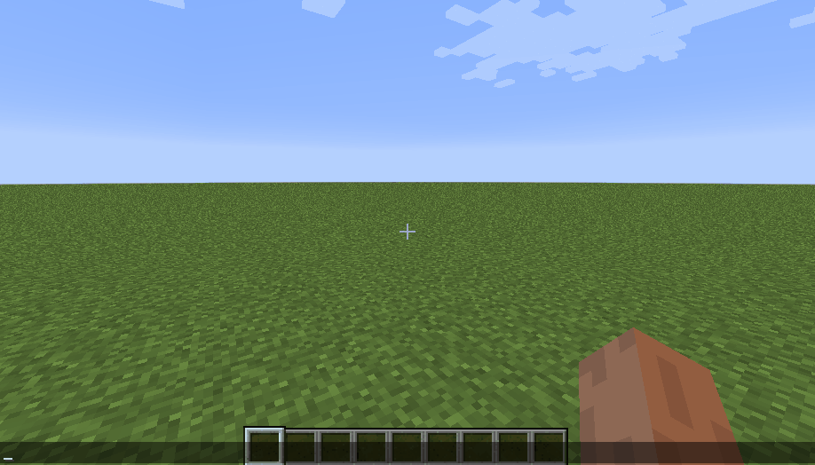
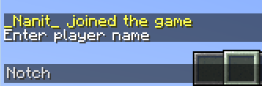
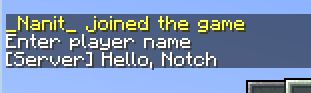
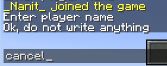

.. include:: ../_includes/datatypes.rst

User input
==========

.. include:: ../_includes/contents.rst

This article is about how you can save some user input and use it inside your menus.

.. _input-ctx-main:

Activator context
-----------------

Almost all activators saves own state for each player. We called this state as ``Context``. Context is any object such a:

- Command which player entered
- Block on which player clicked
- Entity or NPC on which player clicked
- WorldGuard region in which player entered
- etc.

Each newly opened (through activator) menu has own context. AbstractMenus allows to get some values from this context just through placeholders.

.. _input-ctx-placeholder:

Context placeholders
--------------------

Access to context's data via placeholders possible due Value Extractors. More about value extractors you can read in :ref:`value-extractors` topic. Here is just described way **how to use spefic extractor as placeholder**.

Each activator uses one of the predefined extractors to provide placeholders for own context.

To get access to activator context's placeholders, you can use placeholder in next format:

::

	%activator_<extractor placeholder>%

Each activator's placeholder start with ``activator_`` prefix. The ``<extractor placeholder>`` is a placeholder which :ref:`defined <extractor-block>` for specific extractor.

.. _input-how-to:

How to use context placeholer of activator
~~~~~~~~~~~~~~~~~~~~~~~~~~~~~~~~~~~~~~~~~~

The algorithm of using context placeholder for activators is simple:

1. Go to :doc:`../general/activators` page.
2. Find required activator.
3. Under each activator you can find extractor which this activator uses. This is a link which refers to table of placeholders of this extractor.

	Extractor type which activator uses

4. Go to table of placeholders of this extractor.
5. Select required placeholder.
6. Add ``activator_`` prefix to this placeholder.
7. Use the resulting value as a placeholder in your menu.

Example 1. Using context placeholders
~~~~~~~~~~~~~~~~~~~~~~~~~~~~~~~~~~~~~

For example, let's say you use ``clickEntity`` activator:

::

	activators {
	  clickEntity {
	    type: SHEEP
	  }
	}

After you clicked on any sheep entity, you can use context placeholders in rules, actions and item properties. Remember, that we use extractor's placeholders with this format: ``%activator_<extractor placeholder>%``. Example:

::

	title: "Sheep menu"
	size: 1
	activators {
	  clickEntity {
	    type: SHEEP
	  }
	}
	items: [
	  {
	    slot: 0
	    material: CAKE
	    name: "Sheep name: %activator_entity_custom_name%"
	    click {
	      message: "&aCurrent sheep location: %activator_entity_loc_x%, %activator_entity_loc_y%, %activator_entity_loc_z%"
	    }
	  }
	]

Here we used ``entity_custom_name``, ``entity_loc_x``, ``entity_loc_y`` and ``entity_loc_z`` extractor placeholders, which defined :ref:`in this place <extractor-entity>`

.. _input-prof-ex:

Example 2. Personal profile menu
~~~~~~~~~~~~~~~~~~~~~~~~~~~~~~~~

Let's create some more interesting menu. We want to make profile menu. When player shift-clicks on other player, we want to open menu with clicked player stats. For this we will use ``shiftClickEntity`` activator.

::

	title: "&b%activator_player_name%'s' profile"
	size: 1
	activators {
	  shiftClickEntity {
	    type: PLAYER
	  }
	}
	items: [
	  {
	    slot: 4
	    skullOwner: "%activator_player_name%"
	    name: "&e%activator_player_displayname%"
	    lore: [
	      "",
	      "&fLevel: %activator_player_level%",
	      "&fXP: %activator_player_exp%",
	      "&fHealth: %activator_player_health%",
	      "",
	      "&aClick, to say hello",
	    ]
	    click {
	      command {
	        console: "tell %activator_player_name% Hello!"
	      }
	    }
	  }
	]

Here, we used placeholder even in menu title, because inventory was created after activator created their context.
We also used PlaceholderAPI placeholders, but with ``activator_`` prefix. We do this, because we sure that menu will be opened only after click on player (because we set ``type: PLAYER``). 

We used regular placeholders, because Entity Extractor can accept them, if entity is player. This and other information about required for you extractor, you can find under each :ref:`extractor's specification <extractor-entity>`

Now, if some player will shift-click other player, our menu will be opened:

	Player's profile menu example

More complex examples of context placeholders usage, see in :doc:`../general/examples` topic.

.. hint:: In this example we used PlaceholderAPI with ``Player`` and ``Statistic`` expansions.

.. _building-commands:

Commands building
-----------------

AbstractMenus has powerful system to build commands and use entered arguments in menus.

In this topic we will talk about more complex format of the ``command`` activator with taking arguments. 
Other information about this activator you can find in :doc:`../general/activators` article.

Command format
~~~~~~~~~~~~~~

To build command with arguments, you need to make ``command`` activator as an :ref:`hocon-obj`.
This object has several required and optional parameters. Below is full structure of ``commands`` activator.

.. csv-table::
	:header: "Key", "Type", "Note", "Required"
	:widths: 3, 4, 10, 2

	"name", |t_str|, "Base name of the command", "true"
	"aliases", |t_list_str|, "Aliases of base name", "false"
	"error", |t_str|, "Custom error message", "false"
	"help", |t_str|, "Custom help message prefix", "false"
	"args", "|t_list_str|, |t_list_obj|", "Command arguments", "false"
	"override", "|t_bool|", "Try to override command from other plugin", "false"

The ``error`` field can contain ``%s`` placeholder to insert error message from specific argument.

The ``help`` field also can contain ``%s`` placeholder to insert generated command help based on command structure.

Example of using ``error`` and ``help`` fields:

::

	command {
	  name: "mycmd"
	  error: "&cInvalid input: %s"
	  help: "&eCommand structure: %s"
	}

The ``args`` field is a list that can accept one of the two types of arguments: **Simple** or **Typed**.

As described in :ref:`extractor-cmd` topic, ``commands`` activator uses Command Extractor to get paraed values from entered command. Example of using this extractor you can see in topic below.

Simple arguments
~~~~~~~~~~~~~~~~

Simple arguments is just list of argument keys. Every argument is a string, so user can enter anything. Example:

::

	command {
	  name: "mycmd"
	  args: [ "myarg1", "myarg2" ]
	}

After reloading, AbstractMenus will expect that player will enter command in format:

::

	/mycmd <myarg1> <myarg2>

When player entered command and all arguments specified, menu will be opened. Otherwise player receives error message.

To get values which player entered, you need to use context placeholders, as described :ref:`above <input-ctx-placeholder>`. Just see which placehodlers provides :ref:`extractor-cmd` and add ``activator_`` prefix in begin. Example:

::

	message: "You entered %activator_cmd_arg_myarg1% and %activator_cmd_arg_myarg2%"

.. note: The order of simple and typed arguments is matter.

Typed arguments
~~~~~~~~~~~~~~~

Typed arguments allows you to expect players to enter arguments of a certain type. If player entered something wrong, he will get error message.

There are several types of arguments.

:string: Simple string argument. Player can enter anything, without space symbol.

:number: Any number: float or integer. Fails if number cannot be parsed from user input.

:integer: Integers only. Fails if number cannot be parsed to integer from user input.

:player: Online player name. Will suggest all players on tab complete, and fails if player not found.

:choice: Predefined string options. Will be suggested on tab complete. Player must select one of the suggested options.

Each typed argument is an object with parameters. All they has general fields which described below:

.. csv-table::
	:header: "Key", "Type", "Note", "Required"
	:widths: 3, 4, 10, 2

	"key", |t_str|, "Unique argument name, which you will use in placehodlers", "true"
	"type", |t_str|, "Argument type. See all types above", "true"
	"error", |t_str|, "Custom error message", "false"
	"default", |t_str|, "Default value of argument. Makes argument optional", "false"

Example 1. Number argument
""""""""""""""""""""""""""

::

	command {
	  name: "mycmd"
	  args: [
	    {
	      key: "amount"
	      type: number
	    }
	  ]
	}

Then to get value from this argument, we will use this placeholder:

::

	message: "&eAmount: %activator_cmd_arg_amount%"

Example 2. Choice argument
""""""""""""""""""""""""""

The ``choice`` argument type required one additional field: ``options``. This is a list of strings. Each element is an option.

::

	command {
	  name: "mycmd"
	  args: [
	    {
	      key: "variant"
	      type: choice
	      options: ["opt1", "opt2", "opt3"]
	    }
	  ]
	}

Then to get selected option from this argument, we will use this placeholder:

::

	message: "&eSelected %activator_cmd_arg_variant%"

Example 3. Player argument
""""""""""""""""""""""""""

Player argument takes only online player name and suggest these names on tab complete.

::

	command {
	  name: "mycmd"
	  args: [
	    {
	      key: "username"
	      type: player
	    }
	  ]
	}

Then to get name of player from this argument, we will use this placeholder:

::

	message: "&ePlayer: %activator_cmd_arg_username%"

Using regular placeholders for player argument
~~~~~~~~~~~~~~~~~~~~~~~~~~~~~~~~~~~~~~~~~~~~~~

The ``player`` argument has one cool feature. In cases when you use ``player`` argument, 
AbstractMenus saves entered player and provides access to their regular placeholders. Example:

::

	command {
	  name: "mycmd"
	  args: [
	    {
	      key: "player1"
	      type: player
	    },
	    {
	      key: "player2"
	      type: player
	    }
	  ]
	}

For example, we need to get level of these two players. Command extractor gives access to this and other placeholders. Following extractor's placeholder format (``<key>:<placeholder>``), which described in :ref:`extractor-cmd` topic, we need to specify two parameters: argument's key and placeholder which we want to use. We want to use ``player_level`` placeholder, so our final placeholder will looks like:

::

	%activator_player1:player_level%
	and
	%activator_player2:player_level%

Default arguments
~~~~~~~~~~~~~~~~~

Let's talk more about ``default`` argument's field. In some cases you need to make some argument optional. For example, you want to make profile menu. If player entered username, then profile of other player will be opened. If no, then will be opened profile of player who entered command. 

For logic like this, you can add default value to some argument. You can use regular placeholders in default values. Example:

::

	command {
	  name: "profile"
	  args: [
	    {
	      key: "user"
	      type: player
	      default: "%player_name%"
	    }
	  ]
	}

If player enter ``/profile``, then ``user`` argument will be equal name of player who entered command.

If player enter ``/profile Notch``, then ``user`` will be ``Notch``.

Currently, AbstractMenus has some resctiction for optional arguments. You can make only one optional argument and put it only in the end of arguments list. This due arguments parsing algorithm, which can't know which argument you entered, if there are more than one optional argument.

.. note: Commands with default values doesn't throw error if they missing. But they throws error if they specified wrong.

Final example. Open profile menu by command
~~~~~~~~~~~~~~~~~~~~~~~~~~~~~~~~~~~~~~~~~~~

Let's modify our example, which we made :ref:`before <input-prof-ex>`. We will replace ``shiftClickEntity`` activator to ``command`` and make command take player name:

::

	title: "%activator_user:player_name%'s profile"
	size: 1
	activators {
	  command {
	    name: "profile"
	    args: [
	      {
	        key: "user"
	        type: player
	        default: "%player_name%"
	      }
	    ]
	  }
	}
	items: [
	  {
	    slot: 4
	    skullOwner: "%activator_user:player_name%"
	    name: "&e%activator_user:player_displayname%"
	    lore: [
	      "",
	      "&fLevel: %activator_user:player_level%",
	      "&fKills: %activator_user:statistic_mob_kills%",
	      "&fDeaths: %activator_user:statistic_deaths%",
	      "",
	      "&aClick, to say hello",
	    ]
	    click {
	      command {
	        console: "tell %activator_user:player_name% Hello!"
	      }
	    }
	  }
	]

We also changed placeholders to fit format, described for Command Extractor. Result you can see below.

	How commands work

Command overriding
~~~~~~~~~~~~~~~~~~

Sometimes we need to override command from other plugin. 
For example, you have third-party plugin with ``/kit`` command.

Suppose we want to create menu which will be opened by the same command and will show list of available kits.
By default, AbstractMenus register command by regular way. This means that any menu command may be overwritten by other plugins.

To override plugin command, you can add ``override: true`` parameter to the command activator body. Example:

::

	activators {
	  command {
	    name: "kit"
	    aliases: ["kits"]
	    override: true
	  }
	}

Command with ``override: true``, will be registered as chat listener, not only as regular command. 
This will allow to "override" third-party plugin command, even if AbstarctMenus loaded after this plugin.

When user enter such command, plugin performs it as regular command and cancel next message handling to avoid performing this command by the real "command owner".

.. _input-chat:

Chat Input
----------

Action ``inputChat`` allows you to request some text input to player. 
Below is the structure of this action.

.. csv-table::
	:header: "Parameter", "Type", "Note", "Required"
	:widths: 3, 4, 10, 2

	"into", |t_str|, "Name of variable in which data will be saved", "true"
	"global", |t_bool|, "If ``true``, data will be saved in the global variable. By default is ``false``", "false"
	"cancelOn", |t_str|, "A 'stop word' or phrase that will cancel waiting for input. If input cancelled, actions inside ``onCancel`` will be executed instead of ``onInput``", "false"
	"onInput", |t_obj|, "Actions for completed input", "false"
	"onCancel", |t_obj|, "Actions for cancelled by stop word input", "false"

The only required paramater is a ``into``. This is the name of :doc:`variable <../general/variables>`. 
When player enter a text in the chat, plugin save this text into variable with specified name. 
After this, you can get value if this variable anywhere through :ref:`variable placeholder <vars-access>`.

Basic example:

::

	slot: 0
	material: STONE
	click {
	  message: "Enter player name"
	  inputChat {
	    into: "input_username"
	  }
	}

If player clicked on this item, menu will be closed with message. 
After this, player must write something in chat.

If you want to perform some action, after text entered, you need to use ``onInput`` actions block. Example:

::

	slot: 0
	material: STONE
	click {
	  message: "Enter player name"
	  inputChat {
	    into: "input_username"
	    onInput {
	      command: {
	        console: "say Hello, %varp_:input_username%!"
	      }
	    }
	  }
	}

Result:

	Waiting for input

Here, when player entered something in the chat, all players will 
see ``Hello, <text>!`` where ``<text>`` is a text, entered by player.

	Input completed

.. note:: After performing ``inputChat``, menu will be closed automatically. **Do not** close it manually by ``closeMenu`` action.

Input Cancelling
~~~~~~~~~~~~~~~~

If you want to add ability to cancel text input, you can add ``cancelOn`` parameter to the action. 
Example:

::

	slot: 0
	material: STONE
	click {
	  message: "Enter player name"
	  inputChat {
	    into: "input_username"
	    cancelOn: "cancel"
	    onInput {
	      command: {
	        console: "say Hello, %varp_:input_username%"
	      }
	    }
	    onCancel {
	      message: "Ok, do not write anything"
	    }
	  }
	}

Here we also added ``onCancel`` block to send message to player if input cancelled.
If player entered ``cancel`` in the chat, plugin will not wait for input anymore, and performs action inside ``onCancel`` if it specified.

	Input cancelled by stop-word

Restrictions
~~~~~~~~~~~~

Note, that not all stuff, that available in menu, allowed inside ``onInput`` and ``onCancel`` blocks.

Since menu is closed while waiting for input, you can only use actions which are not interacts with menu inventory. 
**Do not use** actions like ``refreshMenu``, ``closeMenu``, ``openMenu``, etc.

Context placeholder also won't work inside these action blocks. 
This is not possible due menu lifecycle, so you can use only common placeholders and variables.