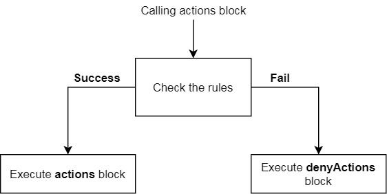

Logical structures
==================

.. include:: ../_includes/contents.rst

In general, all logical structures in AbstractMenus works as **if -> then -> else**. These structures can be nested.

Actions block
-------------

Each actions block is a complex object that can contains rules and other actions. Below is a real structure of actions block:

.. csv-table::
  :header: "Parameter", "Type", "Destination"
  :widths: 10, 10, 10

  "rules", "Rules block", "Regular rules"
  "actions", "Actions block", "Actions that performs if player matches all rules"
  "denyActions", "Actions block", "Actions that performs if player **doesn't matches** all rules"

You can imagine this block as infinite tree where every branch is a rule or actions block.

  Actions block structure

Below is an example of using actions block with more complex structure:

::

  title: "Example"
  size: 6
  openActions {
    message: "Opening the menu..."
    rules {
      permission: "super.admin"
    }
    actions {
      message: "You have super.admin permission!"
      rules {
        money: 1000
      }
      actions {
        takeMoney: 1000
      }
      denyActions {
        giveMoney: 1000
      }
    }
  }

Here is an order of all actions that will be performed when player opens the menu:

#. The message "Opening the menu..." will be displayed in chat.
#. The permission check will run and check if a player has the "super.admin" permission.
#. If he does, than goes to the action block and send message "You have super.admin permission!".
#. Check is player has 1000 money on his balance.
#. If he does, withdraw them.
#. If he doesn't, then add 1000 money to his balance.

.. note:: The rules inside the actions block doesn't affect on the parent actions blocks. In case of instance above, checking for the permission and availability of money will not affect on menu opening.

Rules block
-----------

Local actions
~~~~~~~~~~~~~

In each rules block you can specify local actions. This useful in case when you cannot use ``actions`` and ``denyActions`` blocks outside. Example:

::

  items: [
    {
      slot: 0
      material: STONE
      rules {
        permission: "am.admin"
        actions {
          message: "Yes!"
        }
        denyActions {
          message: "Nope"
        }
      }
    }
  ]

As always, actions described in the ``actions`` block will be executed if the player matches all rules in the ``rules`` block. And ``denyActions`` block will be executed if the player doesn't matches at least one of the rules in the current scope.

In the example above, the message "Nope" will send to the player if the player doesn't have the ``am.admin`` permission. The ``actions`` block, if it specified, will work oppositely, that is, if the player matches the rules.

.. logical-rules-list:

Rules block as list
~~~~~~~~~~~~~~~~~~~

Actually, any ``rules`` block is a :ref:`list of objects <hocon-list-obj>`, where each object is a rules block. Before that, always when we described the rules, we just opened the ``rules`` block and wrote the rules there like this:

::

  rules {
    permission: "super.admin"
    group: "vip"
  }

Since rules block is a list of other rules block, you can specify similar rules and add own local actions to every block.

::

  click {
    message: "You clicked on a pebble"
    rules: [
      {
        permission: "my.perm"
        actions {
          message: "You have permission"
        }
      },
      {
        money: 500
        actions {
          message: "You have enough money"
        }
        denyActions {
          message: "You don't have enough money. Take it though."
          giveMoney: 500
        }
      }
    ]
    actions {
      message: "You have enough money and the right permission!"
    }
  }

In this example we used the rules block as a list. Let see what happens when you click on an item in order:

#. The message "You clicked on a pebble."
#. The player will be checked for "my.perm" permission.
#. If there is a permission, the message "You have the right permission" will be displayed.
#. Player will be checked for 500 money on balance.
#. If there is money, the message "You have enough money" will be displayed.
#. If there is no money, the player will receive the message "You don't have enough money and 500 coins will be given.
#. If both checks on the permission and money amount were successful, the message "You have enough money and the right permission!" will be displayed.

.. note:: When using rules as a list, each next element of the list performed independ of the result of checking the previous one. In example above, even if the player doesn't have ``my.perm`` permission, the check for the amount of money will still be performed. But in a global sense, the entire ``rules`` block will no longer be considered successful. So, the message "The player has the right and money!" will not be displayed if at least one of the rules block was not successful.

.. _logical-not:

Inverting rule (operator "NOT")
-------------------------------

You can invert result of any rule. For this, just add ``-`` before the rule name. Char ``-`` means "NOT". When you added this "NOT" char before rule name, result of rule will be inverted. If rule returns ``true``, it will return ``false`` and vice versa.

Example:

::

  rules {
    -permission: "group.admin"
  }
  actions {
    message: "You are not Admin :("
  }
  denyActions {
    message: "You are Admin!"
  }

In this example, ``actions`` block will be executed if player have no permission ``group.admin``. This means that ``permission`` rule result was inverted.

.. note:: Unfortunatelly, traditional "NOT" char (``!``) reserved by HOCON, so we decided to use ``-``.

You can use this notation for any rule, even for logical wrappers. About logical wrappers in the next part.

Logical rule wrappers
---------------------

By default, ``rules`` block works with "AND" condition. Even when you use ``rules`` block as list, this rules works with "AND" condition.
Logical wrappers created to add ability to create more complex conditions. You can combine rules ``and``, ``or``, and operator "NOT".
Technically, logical wrappers is just a rules which can contain other rules. So this wrappers must be specified inside ``rules`` block.

.. _logical-and:

Wrapper "AND"
~~~~~~~~~~~~~

Since ``rules`` block works with "AND" condition, this wrapper exists to use it inside ``or`` wrapper.
But anyway we will show example of using this wrapper.

::

  rules {
    and {
      permission: "group.vip"
      gamemode: CREATIVE
    }
  }

In example above, rule ``and`` will return ``true`` if player have permission ``group.vip`` **AND** gamemode CREATIVE.

Another example with using wrapper as list of rules groups. This format similar to format described `above <logical-rules-list>`_

::

  rules {
    and: [
      {
        permission: "group.vip"
        gamemode: CREATIVE
      },
      {
        permission: "group.helper"
      }
    ]
  }

In this example, rule ``and`` will return ``true`` if player have permission ``group.vip`` **AND** gamemode CREATIVE **AND** permission ``group.helper``.

.. _logical-or:

Wrapper "OR"
~~~~~~~~~~~~

This logical wrapper will return true if **at least one** of the rules inside return true.

::

  rules {
    or {
      permission: "group.vip"
      gamemode: CREATIVE
    }
  }

In this example, rule ``or`` will return ``true`` if player have permission ``group.vip`` **OR** gamemode CREATIVE.

This behaviour also works when you use ``or`` rule as list of rules groups. Example:

::

  rules {
    or: [
      {
        permission: "group.vip"
        gamemode: CREATIVE
      },
      {
        permission: "group.helper"
      }
    ]
  }

In this example, rule ``or`` will return ``true`` if player have permission ``group.vip`` **OR** gamemode CREATIVE **OR** permission ``group.helper``.

.. _logical-oneof:

Wrapper ``oneof``
~~~~~~~~~~~~~~~~~

The ``oneof`` wrapper useful if use it as list with local actions. It works like ``and``, but with one feature.
If use ``and`` rule as list of individual rules like:

::

  rules {
    and: [
      {
        permission: "perm1"
        actions {
          message: "You have perm1"
        }
      },
      {
        permission: "perm2"
        actions {
          message: "You have perm2"
        }
      }
    ]
  }

then if player has permission from first block (``perm1``), then local actions will be executed, **but** each next rules also will be checked, and player will receive unwanted messages. In the end, the whole rule ``and`` will return ``false`` if at least one of the rules inside returned ``false``.

In some cases this behavior is not preferable, so ``oneof`` wrapper can help. If you write same rule but using ``oneof`` wrapper:

::

  rules {
    oneof: [
      {
        permission: "perm1"
        actions {
          message: "You have perm1"
        }
      },
      {
        permission: "perm2"
        actions {
          message: "You have perm2"
        }
      }
    ]
  }

then if player has permission ``perm1`` local actions also will be executed, **but** the whole ``oneof`` block will be stopped and return ``true``. If player has no any of the specified permissions, the ``oneof`` rule will return ``false``.

So with ``oneof`` you can use local actions and be sure that they will be executed only if at least **one of** the rules block returned ``true``. Example:

::

  rules {
    oneof: [
      {
        permission: "perm1"
        actions {
          message: "You have perm1"
        }
      },
      {
        permission: "perm2"
        actions {
          message: "You have perm2"
        }
      }
    ]
    denyActions { // Will be executed only if all rules in list failed
      message: "You have no any of required rules"
    }
  }

Combining logical wrappers
~~~~~~~~~~~~~~~~~~~~~~~~~~

You can combine logical wrappers and make more complex conditions. Example:

::

  rules {
    or: [
      {
        and {
          permission: "vip"
          gamemode: CREATIVE
        }
      },
      {
        and {
          permission: "premium"
          gamemode: SURVIVAL
        }
      }
    ]
  }

In this example, rule ``or`` will return ``true`` if:

Player have permission ``vip`` AND gamemode CREATIVE

**OR**

Player have permission ``premium`` AND gamemode SURVIVAL

Using same actions and rules inside one block
---------------------------------------------

As other configuration languages, HOCON doesn't allow to use similar keys in same block multiple times. For example, this block:

::

  click {
    message: "Hello" // Ok
    message: "Hello again" // Parsing error
  }

will cause parsing error, because one block is not able to has several params with same key. It may be inconvenient, for example, when you need to execute several actions with same name. AbstractMenus has ``bulk`` wrapper for this, but this is a hard readable way. AbstractMenus has tricky way to solve this problem.

To add several similar actions or rules inside same block, just add prefix with ``_`` char to parameter name. For example:

::

  click {
    message: "Hello"
    _message: "Hello again"
    __message: "Hello again again"
    ___message: "Hello again again again"
  }

The code above won't produce parsing errors, because all params has different names. 
After parsing but before deserializing actions and rules, plugin removes all ``_`` chars from parameter name prefix, so all action and rule names will be correct.

.. note:: Removing ``_`` symbol occurs only from prefix. Plugin doesn't touch this symbol in center of parameter name.

This feature also allows to use multiple rules under one logical block. Example:

::

	rules {
	  or {
	    gamemode: SURVIVAL
	    _gamemode: ADVENTURE
	    __gamemode: SPECTATOR
	  }
	}

Since we use ``or`` rule wrapper, it will return ``true`` if atleast one of the rule is ``true`` for player.

In this case multiple ``gamemode`` rules with this prefix will work similar to:

::

	rules {
	  or: [
	    { gamemode: SURVIVAL },
	    { gamemode: ADVENTURE },
	    { gamemode: SPECTATOR }
	  ]
	}

So, using ``_`` prefix for rules we avoiding boilerplate code.