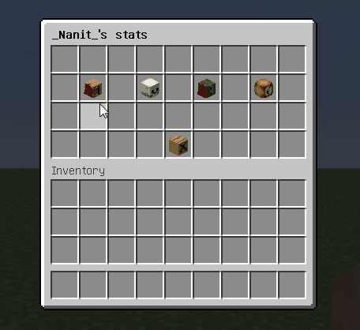
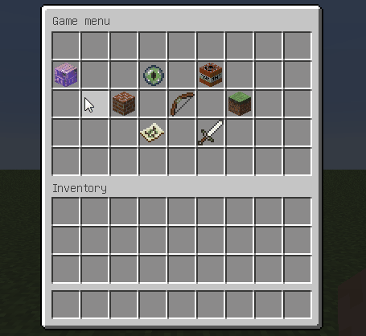
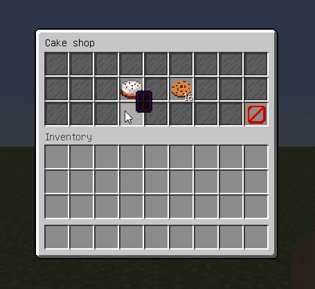
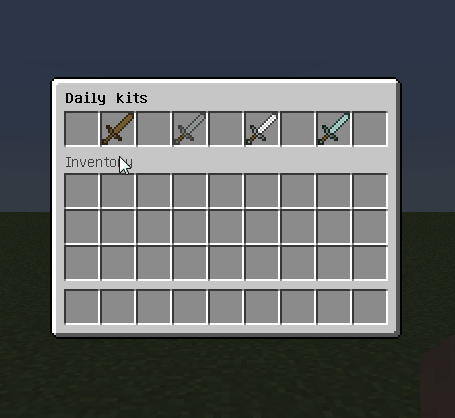
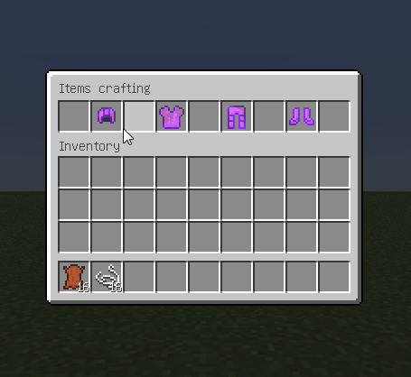
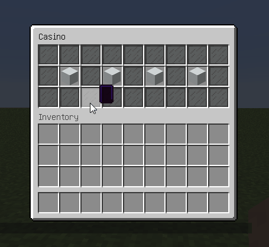

Examples
========

.. include:: ../_includes/contents.rst

We prepared some examples of menus. They are sorted by difficult:

:Simple menus: Menus with minimum features and required knowledges to repeat it by yourself.
:Medium menus: Menus with using some not so difficult features, like variables, or more complex logical structures.
:Advanced menus: Menus with advanced features using, like templates, animations, etc.

.. attention:: All these examples works only with Spigot 1.13 and higher! So, here we used 1.13+ material names.

Simple menus
------------

.. csv-table::
	:header: "Name", "Depends", "Preview"
	:widths: 5, 5, 10

	"`Player stats <https://github.com/AbstractMenus/examples/blob/main/simple/stats.conf>`_", "PlaceholderAPI with Player and Statistic expansions", |preview-stats|
	"`BungeeCord servers selector <https://github.com/AbstractMenus/examples/blob/main/simple/servers.conf>`_", "BungeeCord, PlaceholderAPI with Player and Bungee expansions", |preview-servers|
	"`Cake shop <https://github.com/AbstractMenus/examples/blob/main/simple/cake_shop.conf>`_", "Vault and any Economy plugin", |preview-cakes|

Medium menus
------------

.. |preview-shop| image:: ../_static/examples/shop.gif

.. csv-table::
	:header: "Name", "Depends", "Preview"
	:widths: 5, 5, 10

	"`Daily kits <https://github.com/AbstractMenus/examples/blob/main/medium/kits.conf>`_", "LuckPerms", |preview-kits|
	"`Crafting <https://github.com/AbstractMenus/examples/blob/main/medium/craft.conf>`_", "Nothing", |preview-craft|
	"`Shop <https://github.com/AbstractMenus/examples/blob/main/medium/shop.conf>`_", "Vault and any Economy plugin", |preview-shop|

Advanced menus
--------------

.. csv-table::
	:header: "Name", "Depends", "Preview"
	:widths: 5, 5, 10

	"`Casino <https://github.com/AbstractMenus/examples/blob/main/advanced/casino>`_", "Vault and any Economy plugin", |preview-casino|