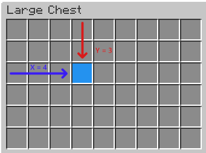
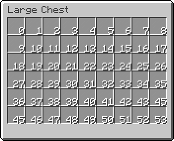
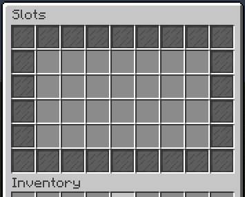
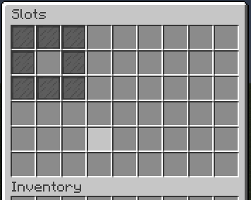

.. include:: ../_includes/datatypes.rst

.. |ex_below| replace:: See example

Item format
===========

.. include:: ../_includes/contents.rst

An item can be specified not only as a button in a menu. This :ref:`object <hocon-obj>` can be used in rules, actions and activators. However, item always has one format.

All item properties
-------------------

.. csv-table::
	:header: "Name", "Data type", "Example", "Description", "Replace material"
	:widths: 5, 5, 10, 30, 5

	"slot", |t_mult|, |ex_below| :ref:`prop-slot`, "Set slot for item. Not a regular item's property. Can be used only for menu items or in some actions and rules", "No"
	"material", |t_str|, ``material: "DIAMOND_SWORD"``, "Set the item material. On MC ``1.12`` and lower, numerical ids are supported", "Yes"
	"name", |t_str|, ``name: "Peter Piper"``, "Set display name", "No"
	"data", |t_int|, ``data: 2``, "Material data (deprecated since MC ``1.13``, full material names are used instead)", "No"
	"count", |t_int|, ``count: 64``, "Amount of item stack", "No"
	"damage", |t_int|, ``damage: 100``, "Set damage (bar under item) for damageable items. The higher the number, the lower the durability of the item", "No"
	"lore", |t_list_str|, |ex_below| :ref:`prop-lore`, "Set item lore (text under name)", "No"
	"hdb", |t_str|, ``hdb: "2853"``, "Set the head by the identifier from the `HeadDatabase <https://www.spigotmc.org/resources/14280/>`_", "Yes"
	"glow", |t_bool|, ``glow: true``, "Set glowing effect (via invisible enchantment)", "No"
	"texture", |t_str|, ``texture: "<texture_id>"``, "Sha-1 hash of the skin from the server ``http://textures.minecraft.net/texture/<texture_id>``. You can find this hash, for example, on the https://minecraft-heads.com", "Yes"
	"skullOwner", |t_str|, ``damage: 100``, "Set player's skin on head", "Yes"
	"enchantments", |t_obj|, |ex_below| :ref:`prop-ench`, "Add enchantment to item", "No"
	"color", |t_str|, |ex_below|, "Colorize armor or potion", "No"
	"flags", |t_list_str|, |ex_below| :ref:`prop-flags`, "Add item flags", "No"
	"unbreakable", |t_bool|, ``unbreakable: true``, "Make item unbreakable (works on ``1.9+``)", "No"
	"potionData", |t_list_obj|, |ex_below| :ref:`prop-potion`, "Add various potion effects for item, if this item is potion", "No"
	"mmoitem", |t_str|, ``mmoitem: "WEAPON:MY_SWORD"``, "Takes an item by type and id from the `MMOItems <https://www.spigotmc.org/resources/39267/>`_", "Yes"
	"fireworkData", |t_list_obj|, |ex_below| :ref:`prop-firework`, "If material is ``FIREWORK_ROCKET``, or ``FIREWORK``, it sets various settings of the fireworks", "No"
	"bookData", |t_obj|, |ex_below| :ref:`prop-book`, "Add book's content and metadata (author, title) for writable book", "No"
	"model", |t_int|, ``model: 1234567``, "Custom model data", "No"
	"enchantStore", |t_obj|, Same as :ref:`prop-ench`, "Allows you to save the enchantment in an item that can later be used to enchant items on the anvil. Need for creating an enchantment book (``1.12+``). Works with ``ENCHANTED_BOOK`` material", "No"
	"recipes", |t_list_obj|, "Same as recipe format", "Create a book with custom recipes (knowledge book). Works with ``KNOWLEDGE_BOOK`` material", "No"
	"nbt", |t_obj|, |ex_below| :ref:`prop-nbt`, "Add NBT tags to the item", "No"

.. _prop-slot:

Slot
----

The item's slot is the cell in the inventory (of the menu or player's) where the item will be placed. The slot can be specified in several ways:

Way 1. X, Y coordinates
~~~~~~~~~~~~~~~~~~~~~~~

::

	slot: "4,3" // x,y

In this example, ``x`` and ``y`` means the horizontal and vertical position of the item, respectively. The countdown starts from 1. The image below can be useful to understanding this.

	How XY slots works

Way 2. Index
~~~~~~~~~~~~

::

	slot: 0

You can specify slot just by a real index. To find out the number of the desired slot, you can use this cheat sheet:

	Slots indexes

Way 3. Range
~~~~~~~~~~~~

::

	slot: "0-6"

To place one item inside several slots, you can use ranged slots format. An item with slot above will be placed in cells with index 0, 1, ..., 6.
This format can be useful to fill menu with some background item without manual putting them in every slot.

Way 4. Matrix
~~~~~~~~~~~~~

::

	items: [
	  {
	    slot: [
	      "xxxxxxxxx",
	      "x-------x",
	      "x-------x",
	      "x-------x",
	      "x-------x",
	      "xxxxxxxxx"
	    ]
	    material: BLACK_STAINED_GLASS_PANE
	  }
	]

If you need more complex positioning, you can specify slot as cells matrix. For example, you need set a border for your menu. You can make something like above. Then this will look like this:

	Result of using cells matrix

Every char of this matrix is a some slot.

Char ``-`` is always empty slot.
Char ``x`` represents slots which will be filled with current item. You can specify any other char except ``-``.

The size of matrix may be equal or less than size of menu. This mean, you can specify slot like that with the same size of menu:

::

	slot: [
	  "xxx",
	  "x-x",
	  "xxx"
	]

And menu will looks like this:

	Result of using lesser cells matrix

.. note:: The slots counting in cells matrix always starts from top-left.

.. attention:: Items placed by ranged slots and cells matrix doesn't cloning. This mean that if you change property of some item, changes will apply to other items placed by this slot. So you shouldn't use this slot format for unique items.

.. _prop-lore:

Lore
----

The lore is a :ref:`list of strings <hocon-list-str>`. Each new line in the list is a line in the item's lore. For example:

::

	lore: [
	  "Line 1",
	  "Line 2",
	  "Line 3"
	]

.. _prop-ench:

Enchantments
------------

Enchantments has format ``<enchantment>: <level>`` where:

:<enchantment>: Bukkit's ehcnantment name. You can find it `here <https://hub.spigotmc.org/javadocs/spigot/org/bukkit/enchantments/Enchantment.html>`_
:<level>: Level of the enchantment. Minimal level is ``1``.

Example:

::

	enchantments {
	  DAMAGE_ALL: 1
	  DURABILITY: 2
	}

.. _prop-color:

Color
-----

Color used to paint items that support it, such as leather armor or potion. Color can be specified in one of 3 ways. In the examples, we will show a way to specify white color.

Way 1. RGB
~~~~~~~~~~

RGB values (0-255) separated by comma.

::

	color: "255,255,255" // r,g,b

Way 1. Spigot color name
~~~~~~~~~~~~~~~~~~~~~~~~~~

Use a native Spigot color names.

::

	color: WHITE

.. seealso:: You can find list of colors `here <https://hub.spigotmc.org/javadocs/bukkit/org/bukkit/Color.html>`_

Way 1. HEX
~~~~~~~~~~

Hexadecimal format like in CSS.

::

	color: "#FFFFFF"

.. note:: Colors can be used only for painting leather armor, potions and other materials that supports it.

.. _prop-flags:

Flag
----

Flags are used to add new properties to item. The list of flags is a :ref:`strings list <hocon-list-str>` like ``lore``. For example:

::

	flags: [
	  "HIDE_UNBREAKABLE",
	  "HIDE_ENCHANTS",
	]

Or if there is only flag:

::

	flags: "HIDE_ATTRIBUTES"

Spigot currently has the following flags:

:HIDE_ATTRIBUTES: Hide item attributes such as damage.
:HIDE_DESTROYS: Hide the information about item durability.
:HIDE_ENCHANTS: Hide item enchantments.
:HIDE_PLACED_ON: Hide information that an item can be built/placed on something like this.
:HIDE_POTION_EFFECTS: Hide potion effects :D.
:HIDE_UNBREAKABLE: Hide the ``unbreakable`` label.

.. note:: A flags for each Spigot versions might be different or missing. Check flags for your version only on `this <https://hub.spigotmc.org/javadocs/bukkit/org/bukkit/inventory/ItemFlag.html>`_ or similar pages. Do not trust the list above for 100%.

.. _prop-potion:

Potion effect
-------------

This property is a :ref:`list of objects <hocon-list-obj>` containing effects of the potion. Each item in the list is a potion effect. Example:

::

	potionData: [
	  {
	    effectType: FAST_DIGGING
	    duration: 100
	    amplifier: 1
	  },
	  {
	    effectType: SPEED
	    duration: 100
	    amplifier: 2
	  }
	]

Each potion effect has 3 required parameters:

:effectType: Potion effect type. All types can be found `here <https://hub.spigotmc.org/javadocs/spigot/org/bukkit/potion/PotionEffectType.html>`_.
:duration: Potion effect duration in ticks (1 second = 20 ticks).
:amplifier: Power (level) of the effect.

.. note:: The ``potionData`` property can be used only if item's material supports this.

.. _prop-firework:

Firework
--------

To create a colored firework, use ``fireworkData`` property. Example:

::

	fireworkData: [
	  {
	    type: BALL
	    trail: false
	    colors: [
	      "#FFFFFF",
	      "#FF0000"
	    ]
	    fadeColors: [
	      "#000000",
	      "#00FF00"
	    ]
	  },
	]

The ``fireworkData`` property is a :ref:`list of objects <hocon-list-obj>`. Each object is a firework effect and has several parameters:

:type: Type of the shape when firework explodes. You can find all firework types `here <https://hub.spigotmc.org/javadocs/bukkit/org/bukkit/FireworkEffect.Type.html>`_.
:trail: Is firework has trail while launched.
:colors: List of colors when firework's explode start.
:fadeColors: List of colors when firework's explode fade.

You can add several objects in ``fireworkData`` property. Then it will explode with all specified effects.

.. note:: This property will only work if the material of the item is ``FIREWORK_ROCKET`` (or ``FIREWORK`` on Spigot ``1.12`` and lower).

.. _prop-book:

Book
----

This property can be used to create a written book with pages. Example:

::

	bookData {
	  author: "Peter Piper"
	  title: "&e&lTitle"
	  pages: [
	    "First page content",
	    "Second page content"
	  ]
	}

This property has several parameters:

:author: The book's author which will be displayed.
:title: The displayed book's title.
:pages: The :ref:`list of strings <hocon-list-str>`. Each new line is a new page content.

.. note:: The ``bookData`` porperty will only work for ``WRITTEN_BOOK`` material.

.. _prop-banner:

Banner
------

To create a decorated banner, use the ``bannerData`` property. There are two ways to use it:

Way 1. JSON
~~~~~~~~~~~

You can generate a banner in any banner designer, for example in `this <https://www.needcoolshoes.com/banner>`_, and paste the result JSON as a string parameter. Example:
::

	bannerData: "{BlockEntityTag: {Base: 12, Patterns: [{Pattern: hh, Color: 6}, {Pattern: vh, Color: 6}, {Pattern: lud, Color: 7}, {Pattern: tts, Color : 6}, {Pattern: vh, Color: 14}, {Pattern: cre, Color: 2}]}}"

Way 2. HOCON
~~~~~~~~~~~~

A more complicated, but affordable way is to specify patterns as :ref:`list of objects <hocon-list-obj>`. Example:

::

	bannerData: [
	  {
	    type: BASE
	    color: WHITE
	  },
	  {
	    type: MOJANG
	    color: RED
	  }
	]

Each element of this list is a banner's pattern. Each pattern has this parameters:

:type: Type of the pattern. You can find all pattern types `here <https://hub.spigotmc.org/javadocs/spigot/org/bukkit/block/banner/PatternType.html>`_.
:color: Color of the pattern. Spigot supports only named colors for banners.

.. _prop-nbt:

NBT tags
--------

Using NBT, you can add properties for items that has not yet been added to the plugin. NBT tags can be specified here using HOCON and not a regular string. For example, you can add a name to an item via NBT tag. Example:

::

	{
	  slot: 0
	  material: IRON_PICKAXE
	  nbt {
	    display {
	      Name: "&aMy pickaxe"
	    }
	  }
	}

.. important:: Placeholders won't work inside NBT tags. This is for optimization purposes, to avoid parsing all string types inside the tag while the plugin is running.

Inside the ``nbt`` property, you can write any HOCON constructs, and the plugin converts them to NBT tags on startup. Please note that many NBT tags differ on different versions of Minecraft. So, if some tag does not work, most likely you specified it wrong.
One more example. Let's add two enchantments to the item:

::

	{
	  slot: 0
	  material: IRON_PICKAXE
	  nbt {
	    display {
	      Name: "My pickaxe"
	    }
	    ench: [
	      {
	        id: 34
	        lvl: 2
	      },
	      {
	        id: 35
	        lvl: 3
	      }
	    ]
	  }
	}

The ``ench`` parameter is a :ref:`list of objects <hocon-list-obj>`. The types and names of tags must exactly match those that must be in the final NBT.

Of course, you can add your own custom tags:

::

	nbt {
	  mytag1: "mytag"
	  mytag2: 15
	  mytag3 {
	    mytag1: "hello"
	  }
	}

Those tags will be added to the item. To check them you can use special plugins or mods.