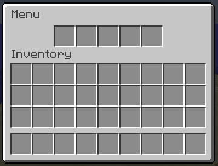
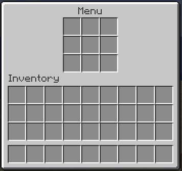

.. include:: ../_includes/datatypes.rst

Menu structure
==============

.. include:: ../_includes/contents.rst

If you already know :doc:`../start/how_to`, so here you will learn in details about menu structure and other useful features of the plugin.

Menu file
---------

Each menu file can contain only menu or several related menus.

Single menu file
~~~~~~~~~~~~~~~~

You may be already met with single menu file though :doc:`../start/how_to` lesson. Below an example of single-file menu.

::

	title: "&8Menu"
	size: 6
	activators {
	  command: "menu"
	}
	items: [
	  {
	    slot: 0
	    texture: "783db86bb86dc2ec494e2ffca77765810ed11a52efef4e5c85252ec39a26c0"
	    name: "Purple-head dwarf"
	    lore: [
	      "The talking head!"
	      ""
	      ">> Click to say \"Hello!\""
	    ]
	    rules {
	      permission: "some.permission"
	    }
	    click {
	      rules {
	        money: 100
	      }
	      actions {
	        command {
	          player: "me Hello!"
	        }
	      }
	      denyActions {
	        message: "You don't have enough money"
	        sound: "ENTITY_VILLAGER_NO"
	      }
	    }
	  }
	]

Menu structure may seem difficult at first sight, but don't be afraid, as you will move forward through the docs you will learn how each part of the plugin works.

Multiple menu file
~~~~~~~~~~~~~~~~~~

If you are making a small sub-menu, this may has sense to do it in a single file with other related menus. To do this, the plugin has a design that allows you to create several menus in a single file. In this case, the menu name will be considered the name of the block in which it is created. Here is an example:

::

	menus {
	  my_awesome_menu { // Unique menu name
	    title: "My menu"
	    size: 6
	    items: [
	      ...
	    ]
	  }
	  my_another_menu {
	    title: "My another menu"
	    size: 1
	    items: [
	      ...
	    ]
	  }
	}

All menus listed in the main ``menus`` block. In the example above you can see 2 separate menus in the same file.

.. important:: All menus names inside ``menus`` block must be unique. If you have several menus with same name, even in different files, plugin will use only last one.

.. _menu-properties:

Menu properties
---------------

The table below contains all the properties of menu which you can specify in menu root.

.. csv-table::
	:header: "Name", "Data type", "Required", "Description"
	:widths: 10, 5, 5, 30

	"title", |t_str|, "Yes", "Set the title of a menu"
	"size", |t_int|, "Yes", "Set the vertical size of a menu (rows count)"
	"type", |t_str|, "No", ":ref:`struct-inventory-type`"
	"items", |t_list_obj|, "No", "Menu items (buttons)"
	"activators", |t_obj|, "No", "An :doc:`activators` to open menu"
	"rules", |t_list_obj|, "No", "A :doc:`rules` to open menu. If even one of those rule is ``false`` then menu won't be opened"
	"preOpenActions", |t_obj|, "No", "An :doc:`actions`, that will be performed **before** inventory creation and menu opening"
	"openActions", |t_obj|, "No", "An :doc:`actions`, that will be performed **before** the menu opened, but **after** open rules successfully checked and inventory created"
	"postOpenActions", |t_obj|, "No", "An :doc:`actions`, that will be performed **after** the menu opened"
	"denyActions", |t_obj|, "No", "An :doc:`actions`, that will be performed if at least one rule is ``false``"
	"closeActions", |t_obj|, "No", "An :doc:`actions`, that will be performed **after** menu closed"
	"updateActions", |t_obj|, "No", "An :doc:`actions` that will be performed when menu updated by ``updateInterval``"
	"updateInterval", |t_int|, "No", "An interval of menu refreshing in ticks. If not specified, menu won't update"

.. _struct-auto-refresh:

Auto refresh
------------

A bit more detailed about the ``updateInterval`` property. If you want to create a menu with auto refresh of items, placeholders and any other dynamic data, you can specify the interval for updating the menu. For example:

::

	title: "Dynamic menu"
	size: 1
	updateInterval: 40 
	items: [
	  {
	    slot: 0
	    material: CAKE
	    name: "Players: %server_players%"
	  }
	]

The menu above will be refreshed every 2 seconds. Along with this, the item that display the number of players on the server will be refreshed along with the placeholder ``%server_players%``.

In the example above we used the default placeholders. More about placeholders you can find on :doc:`placeholders` page.

If you want to do some job when menu updated by ``updateInterval``, you can use ``updateActions`` block.

::

	title: "Timer"
	size: 1
	updateInterval: 20
	updateActions {
	  incVar: "counter:1"
	}

In this example, global variable ``counter`` will be incremented every time menu updated. In our case, with a period of 1 second (20 ticks).

.. note:: Actions inside ``updateActions`` will be performed before items updates, so if you change some variable inside, the result will be seen immediately.

Buttons
-------

The button in the menu is an ordinary item (see :doc:`item_format`) with advanced functionality. Below are all parameters that may be specified in addition to the standard parameters of an item.

.. csv-table::
	:header: "Name", "Data type", "Required", "Description"
	:widths: 10, 5, 5, 50

	"slot", |t_mult|, "Yes", "Set position of an item"
	"rules", |t_list_obj|, "No", "A :doc:`rules` to display buttons in the menu"
	"mrules", |t_list_obj|, "No", "Additional :doc:`rules` block, existing only inside the button. These rules have no effect on whether the button is displayed. They are needed only for independent checks and performing actions"
	"click", |t_obj|, "No", "Contains actions which will execute when player click on item"

As you can see, only the ``slot`` property required for the button, because the menu item always must be in a specific slot or slots.

Display rules
~~~~~~~~~~~~~

A buttons can be displayed without any rules. But you can also add rules for displaying a button in the menu's inventory. These rules will limit showing some buttons if the player doesn't matches with the rules.

::

	items: [
	  {
	    slot: 0
	    material: IRON_SWORD
	  },
	  {
	    slot: 0
	    material: DIAMOND_SWORD
	    rules {
	      permission: "some.perm"
	    }
	  }
	]

In this example, the menu has two items. The first (Iron Sword) will be always displayed in slot 0. The second (Diamond Sword) will be displayed in slot 0 and will replace the first item only if the player have permission ``some.perm``.

Click processing
~~~~~~~~~~~~~~~~

Almost any menu is useless without processing button clicks. The plugin provides a convenient system for processing clicks on buttons.

Let's take a look at the ``click`` block. For example:

::

	items: [
	  {
	    slot: 0
	    material: DIAMOND_SWORD
	    click {
	      left {
	        message: "Hello"
	      }
	    }
	  },
	]

Inside the ``click`` block, the ``left`` block is specified. This is just type of click that triggers the actions inside the block. Inside the block responsible for the type of click, you can describe the same actions and rules as in the ``click`` block.

You can find all types of clicks here. We've described the most useful of them.

.. csv-table::
	:header: "Click type", "Description"

	"LEFT", "Left mouse button click"
	"RIGHT", "Right mouse button click"
	"MIDDLE", "Middle mouse button click"
	"SHIFT_LEFT", "Left mouse button click with Shift pressed"
	"SHIFT_RIGHT", "Left mouse button click with Shift pressed"
	"DOUBLE_CLICK", "Double left mouse button click"

Any of these types can be used inside ``click`` block either individually or together with other types.

::

	items: [
	  {
	    slot: 0
	    material: STONE
	    click {
	      message: "That was the click" // Will be displayed on any click
	      right {
	        message: "That was RMB click" // Will be displayed on RMB click
	      }
	      middle {
	        message: "That was MMB click" // Will be displayed on MMB click
	      }
	    }
	  }
	]

.. _struct-inventory-type:

Inventory type
--------------

You can use other types of inventorym not only chest. 
For this use ``type`` property of menu. This property accepts type name of inventory. 
All type names you can find `here <https://hub.spigotmc.org/javadocs/bukkit/org/bukkit/event/inventory/InventoryType.html>` (for latest Spigot version).

If you use custom inventory type, you can omit a ``slot`` property.

.. warning:: Not every type of invenotry will work. A ``HOPPER`` and ``DISPENSER`` types will work on all supported MC versions. Other types may work incorrectly.

Below is example of menu with custom inventory type.

Hopper
~~~~~~

Code:
::

	title: "Menu"
	type: HOPPER
	activators {
	  command: "menu"
	}
	items: []

Result:

	Hopper inventory

Dispenser
~~~~~~~~~

Code:
::

	title: "Menu"
	type: DISPENSER
	activators {
	  command: "menu"
	}
	items: []

Result:

	Dispenser inventory

.. _struct-bindings:

Binding button properties to rules
----------------------------------

You can bind some button properties to rules. If player matches specified rules, then this property will be applied to final item.
For this, AbstractMenus has special item property called ``bindings``. Example:

::

	items: [
	  {
	    slot: 0
	    material: CAKE
	    bindings {
	      props { material: LEATHER_LEGGINGS }
	      rules { gamemode: CREATIVE }
	    }
	  }
	]

In this example, if player has CREATIVE gamemode, then item's material will be changed to ``LEATHER_LEGGINGS``.

The ``bindings`` block has next format:

:props: Item properties to apply
:rules: Regular rules to check player

Inside ``props`` block you can specify one or multiple :ref:`item properties <prop-all>`, as you do it just inside item. All these properties will be added to item only if player matches rules, specified inside ``rules`` block.

Inside ``rules`` block you can specify any rules, like in any other ``rules`` block.

.. note:: Item must have a default :ref:`material installer <prop-all>`. If you use bindings with material installer property, you just owerwrite it.

.. warning:: In AbstractMenus order of item properties is matter. Since ``bindings`` block is just special item property, you should add bindings to end of all properties, if it exists. Then this will work correctly.

Multiple bindings
~~~~~~~~~~~~~~~~~

You can add multiple bindings to one item. For this, just change the ``bindings`` block to :ref:`list of objects <hocon-list-obj>`. Example:

::

	items: [
	  {
	    slot: 0
	    material: CAKE
	    bindings: [
	      {
	        props { material: LEATHER_LEGGINGS }
	        rules { gamemode: CREATIVE }
	      },
	      {
	        props {
	          lore: [
	            ""
	            "You are VIP!"
	          ]
	        }
	        rules { permission: "group.vip" }
	      }
	    ]
	  }
	]

Here, we changed ``bindings`` block to list and added new binding. Now, if player has ``group.vip`` permission, then new lore will be applied to item.

.. note:: Inside one item, a similar properties in different bindings will be owerwritten by last one. For example, if you use two ``material`` properties for two item bindings, then only last material will be applied (if player matches both).