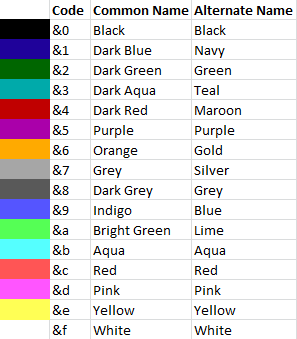

Text formatting
===============

.. include:: ../_includes/contents.rst

Colors codes
------------

As in most plugins, AM replaces ``&`` char to native Minecraft ``§`` color prefix. All text can be colorized. There is some examples below.

::

	message: "&aSome &etext"

You can use this cheat sheet to get required color code.

	Default color codes

RGB colors
----------

Since Spigot 1.14 text can be colorized with RGB colors via hex code. All RGB colors must be concluded between ``<>`` brackets. Example:

::

	message: "<#00FF00>Some text"

This text will be colorized into green color.

RGB colors can also be combined with color codes. Example:

::

	message: "<#00FF00>Some &etext"

.. _mini-message:

MiniMessage format
------------------

.. note:: MiniMessage is a third-party library. To describe their format in out docs, we used content from MiniMessage documentation, whih located `here <https://docs.adventure.kyori.net/minimessage>`_. All rights for this library belongs to KyoriPowered.

To send message, formatted with MiniMessage, you need to use ``miniMessage`` action.

MiniMessage is a string based format to represent Minecraft chat components in a human-readable format that is easy to edit. 

MiniMessage uses tags. Everything you do will be defined with tags. Tags have a start tag and an end tag (the ``<reset>`` tag is an exception here).
Start tags are mandatory (obviously), end tags aren't.
``<yellow>Hello <blue>World<yellow>!`` and ``<yellow>Hello <blue>World</blue>!`` and even ``<yellow>Hello </yellow><blue>World</blue><yellow>!</yellow>`` all do the same.

Some tags have inner tags. Those look like this: ``<tag:inner>stuff</tag>``. For example: ``<hover:show_text:"<red>test:TEST">TEST`` or ``<click:run_command:test>TEST``
As you can see, those sometimes contain components, sometimes just strings. Refer to the detailed docs below.

Single (``'``) and double (``"``) quotes can be used interchangeably, but for your own sanity, please stay consistent, choose one for all your messages. MiniMessage *should* handle mismatched quotes nicely tho.

The components try to represent vanilla as closely as possible.
It might to helpful to use `the minecraft wiki <https://minecraft.gamepedia.com/Raw_JSON_text_format>`_ as a reference, especially for stuff like the actions and values of click and hover events.

Color
******

Color the next parts

Tag
   ``<_colorname_>``
Arguments
   * ``_colorname_``, all minecraft color constants, or hex colors
Examples
   * ``<yellow>Hello <blue>World</blue>!``
   * ``<red>This is a <green>test!``
   * ``<#00ff00>R G B!``

.. image:: https://i.imgur.com/wB32YpZ.png
.. image:: https://i.imgur.com/vsN3OHa.png

List of available colors

* ``black``
* ``dark_blue``
* ``dark_green``
* ``dark_aqua``
* ``dark_red``
* ``dark_purple``
* ``gold``
* ``gray``
* ``dark_gray``
* ``blue``
* ``green``
* ``aqua``
* ``red``
* ``light_purple``
* ``yellow``
* ``white``

Color (verbose)
******************

A more verbose way of defining colors

Tag
   ``<color:_colorNameOrHex_>``
Aliases
   ``colour``, ``c``
Arguments
   * ``_colorNameOrHex_``, can be all the values from above (so named colors or hex colors)
Examples
   * ``<color:yellow>Hello <color:blue>World</color:blue>!``
   * ``<color:#FF5555>This is a <color:#55FF55>test!``

.. image:: https://i.imgur.com/wB32YpZ.png
.. image:: https://i.imgur.com/vsN3OHa.png

Decoration
************

Decorate the next parts

Tag
   ``<_decorationname_>``
Arguments:
   * | ``_decorationname_`` , all minecraft decorations
     | Aliases for ``strikethrough`` -> ``st``, ``obfuscated`` -> ``obf``, ``italic`` -> ``em`` or ``i`` and ``bold`` -> ``b`` exist
Examples:
   * ``<underlined>This is <bold>important</bold>!``

.. image:: https://i.imgur.com/hREGXQy.png

Reset
************

Reset all colors, decorations, hovers etc. Doesn't have a close tag

Tag
   ``<reset>``
Aliases
   ``r``
Arguments
   non
Examples
   * ``<yellow><bold>Hello <reset>world!``

.. image:: https://i.imgur.com/bjInUhj.png

Click
************

Allows doing multiple things when clicking on the component.

Tag
   ``<click:_action_:_value_>``
Arguments
   * ``_action_``, the type of click event, one of the list below
   * ``_value_``, the argument for that particular event, refer to `the minecraft wiki <https://minecraft.gamepedia.com/Raw_JSON_text_format>`_
Examples
   * ``<click:run_command:/say hello>Click</click> to say hello``
   * ``Click <click:copy_to_clipboard:Haha you suck> this </click>to copy your score!``

.. image:: https://i.imgur.com/J82qOHn.png

.. csv-table:: Available click actions
   :header: "Name", "Note"
   :widths: 10, 10

   "open_url", "Opens a url when clicked."
   "open_file", "Opens a file when clicked."
   "run_command", "Runs a command when clicked."
   "suggest_command", "Suggests a command into the chat box."
   "change_page", "Changes the page of a book."
   "copy_to_clipboard", "Copies text to the clipboard. **MC 1.15+**"

Hover
************

Allows doing multiple things when hovering on the component.

Tag
   ``<hover:_action_:_value_>``
Arguments
   * ``_action_``, the type of hover event, one of this below
   * ``_value_``, the argument for that particular event, refer to `the minecraft wiki <https://minecraft.gamepedia.com/Raw_JSON_text_format>`_
Examples
   * ``<hover:show_text:'<red>test'>TEST``

.. image:: https://i.imgur.com/VsHDPTI.png

.. csv-table:: Available hover events
   :header: "Name", "Note"
   :widths: 10, 10

   "show_text", "Shows a text component when hovered over"
   "show_item", "Shows an item instance when hovered over"
   "show_entity", "Shows an entity when hovered over"

Keybind
************

Allows displaying the configured key for actions

Tag
   ``<key:_key_>``
Arguments
   * ``_key_``, the keybind identifier of the action
Examples
   * ``Press <red><key:key.jump> to jump!``

.. image:: https://i.imgur.com/iQmNDF6.png

Translatable
************

Allows displaying minecraft messages using the player locale

Tag
   ``<lang:_key_:_value1_:_value2_>``
Arguments
   * ``_key_``, the translation key
   * ``_valueX_``, optional values that are used for placeholders in the key (they will end up in the ``with`` tag in the json)
Examples
   * ``You should get a <lang:block.minecraft.diamond_block>!``
   * ``<lang:commands.drop.success.single:'<red>1':'<blue>Stone'>!``

.. image:: https://i.imgur.com/mpdDMF6.png
.. image:: https://i.imgur.com/esWpnxm.png

Insertion
************

Allow insertion of text into chat via shift click

Tag
   ``<insertion:_text_>``
Arguments
   * ``_text_``, the text to insert
Examples
   * ``Click <insert:test>this</insert> to insert!``

.. image:: https://i.imgur.com/Imhom84.png

Pre
************

Tags within this tag will not be parsed, useful for player input for example

Tag
   ``<pre>``
Arguments
   non
Examples
   * ``<gray><<yellow><player><gray>> <reset><pre><message></pre>``

.. image:: https://i.imgur.com/pQqaJnD.png

Rainbow
************

Rainbow colored text?!

Tag
   ``<rainbow:[!][phase]>``
Arguments
   * phase, optional
   * ``!``, literal value which reverses the rainbow, optional
Examples
   * ``<yellow>Woo: <rainbow>||||||||||||||||||||||||</rainbow>!``
   * ``<yellow>Woo: <rainbow:!>||||||||||||||||||||||||</rainbow>!``
   * ``<yellow>Woo: <rainbow:2>||||||||||||||||||||||||</rainbow>!``
   * ``<yellow>Woo: <rainbow:!2>||||||||||||||||||||||||</rainbow>!``

.. image:: https://i.imgur.com/Ertlk2G.png

Gradient
************

Gradient colored text

Tag
   ``<gradient:[color1]:[color...]:[phase]>``
Arguments
   a list of 1 to n colors, either hex or named colors and an optional phase param (range -1 to 1) allows you to shift the gradient around, creating animations.
Examples
   * ``<yellow>Woo: <gradient>||||||||||||||||||||||||</gradient>!``
   * ``<yellow>Woo: <gradient:#5e4fa2:#f79459>||||||||||||||||||||||||</gradient>!``
   * ``<yellow>Woo: <gradient:#5e4fa2:#f79459:red>||||||||||||||||||||||||</gradient>!``
   * ``<yellow>Woo: <gradient:green:blue>||||||||||||||||||||||||</gradient>!``

.. image:: https://i.imgur.com/8qYHCWk.png

Font
***********

Allows to change the font of the text

Tag
   ``<font:key>``
Arguments
   the namespaced key of the font, defaulting to ``minecraft``
Examples
   * ``Nothing <font:uniform>Uniform <font:alt>Alt   Uniform``
   * ``<font:myfont:custom_font>Uses a custom font from a resource pack``

.. image:: https://i.imgur.com/0SjeMQm.png