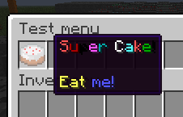

Text formatting
===============

.. include:: ../_includes/contents.rst

Colors codes
------------

As in most plugins, AM replaces ``&`` char to native Minecraft ``§`` color prefix. All text can be colorized. There is some examples below.

::

	message: "&aSome &etext"

You can use this cheat sheet to get required color code.

.. figure:: ../_static/colors.png
	:align: center

	Default color codes

RGB colors
----------

Since Spigot 1.14 text can be colorized with RGB colors via hex code. All RGB colors must be concluded between ``<>`` brackets. Example:

::

	message: "<#00FF00>Some text"

This text will be colorized into green color.

RGB colors can also be combined with color codes. Example:

::

	message: "<#00FF00>Some &etext"

.. _mini-message:

MiniMessage format
------------------

.. important:: To use this format, you need to enable parsing in plugin config. Set ``useMiniMessage`` to ``true``.

MiniMessage is a string based format to represent Minecraft chat components in a human-readable format that is easy to edit. 

This format described in official `MiniMessage documentation <https://docs.adventure.kyori.net/minimessage/format.html>`_.

AbstractMenus supports MiniMessage formatting in messages and item properties like ``name`` and ``lore``. It also works in books. Note, that items supports only colorizing features like colors, rgb colors, gradients, etc. Other MiniMessage features like translatable strings are supported in chat messages only.

Example of using MiniMessage in ``message`` action:

::

   message: "<hover:show_text:'<red>test'>TEST"

Example of using MiniMessage in item's name and lore:

::

   {
      slot: 0
      material: cake
      name: "<rainbow>Super Cake!</rainbow>"
      lore: [
         "",
         "<yellow>Eat <blue>me!"
      ]
   }

       Result