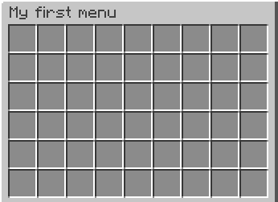
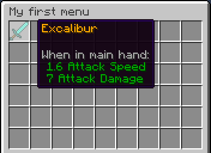

How to create menu
==================

.. contents:: Contents
   :depth: 3

In this brief tour of some plugin features, you will learn how to create simple menus using the AbstractMenus plugin.

.. tip:: Many peoples have problems with menu writing through bad and not smart text editor. We recommend to use the `Sublime Text <https://www.sublimetext.com>`_ or any other smart text editor to convenient edit menu files. This will greatly facilitate your work with the configuration in the HOCON format. Optionally, you could install `plugin for HOCON syntax highlighting <https://packagecontrol.io/packages/HOCON%20Syntax%20Highlighting>`_.

Create a header
---------------

Each menu is a file with ``.conf`` extension. All menu files must be located in the ``plugins/AbstractMenus/menus`` folder. When you run plugin first time, this folder will be created automatically. This folder will also contain the simple menu in ``menu.conf`` file.

.. note:: You could create additional folders in the ``plugins/AbstractMenus/menus`` folder and put menu files in them. No matter how many folders are nested, the plugin will find and load all menus from them. This will allow you to sort related menus.

To create your first menu, create a file with any name but ``.conf`` extension. Note that file name is an unique name of your menu. In our case this is ``menu.conf``, so menu name is just ``menu``. To create a menu header, you need to specify only two parameters - ``title`` and ``size``.

::

	title: "My first menu"
	size: 6

These two parameters mean the following:

:title: Menu title.
:size: The number of inventory rows. The horizontal size cannot be changed without mods, so it's ignored.

This is the base header of any menu. If you reload the plugin using the ``/am reload`` command, you will see message like that:

::

	[AbstractMenus] Loaded 1 menus

Now menu cannot be opened without a special administrator command. To allow players to open the menu, you need to add an activator for this menu.

Add an activator
----------------

An activator is an event that must happen to open menu. To add an activator, you need specify the ``activators`` block in the menu root.

::

	title: "My first menu"
	size: 6
	activators { // Activators block

	}

Now this block is empty. We will use some kind of activator from the list of activators. For example we will use the ``command`` activator. Add it to the ``activators`` block, as shown below.

::

	title: "My first menu"
	size: 6
	activators {
	  command: "mymenu"
	}

After plugin reloading (``/am reload``), try to enter the ``/mymenu`` command in the chat. You will see an empty menu with a given size and **My first menu** title.

	Empty menu we created

If all works for you, that’s great! Now we have an empty menu that does nothing. Let's add some simple functionality.

Add a button
------------

A button is just an item, placed in the menu's inventory. You can learn about all features of the buttons on :doc:`../general/item_format` page. In this lesson we will just show the simplest buttons usage.

So, to add buttons, we need to add a special list of the menu items (buttons).

::

	title: "My first menu"
	size: 6
	activators {
	  command: "mymenu"
	}
	items: [] // List of menu buttons

Now our list is empty. Let's add the first button. Suppose we want to add a diamond sword with some name. To do this, add a new object to the list. This is our item.

::

	title: "My first menu"
	size: 6
	activators {
	  command: "mymenu"
	}
	items: [
	  {
	    slot: 0
	    material: DIAMOND_SWORD
	    name: "&6Excalibur"
	  }
	]

So we've added a new button in our menu. We'll briefly describe the parameters used in this item. For a detailed description of items, visit :doc:`../general/item_format` page.

:slot: Button position, specified by the ordinal number of the inventory cell. You can learn about other ways to specify a slot [here] (Item format#slot).
:material: Id of the item. On Spigot ``1.13+`` only materials by name supported. You can find them `here <https://hub.spigotmc.org/javadocs/bukkit/org/bukkit/Material.html>`_. Numeric ids only works on Spigot ``1.12.2`` and lower.
:name: Display name of the item. As other string values, it supports color codes, placeholders, etc.

Okay, we have a button. If you reload the plugin and open the menu, you will see the created button inside.

	Menu with button we created

Now it does nothing if we click it. Let's add some action for our button.

Add actions to button
~~~~~~~~~~~~~~~~~~~~~
 
To make our button perform some action, there is special ``click`` block for buttons. Now we will show its simplest use. More details about button click processing written on :doc:`../general/menu_structure` page.

::

	title: "My first menu"
	size: 6
	activators {
	  command: "mymenu"
	}
	items: [
	  {
	    slot: 0
	    material: DIAMOND_SWORD
	    name: "&6Excalibur"
	    click {
	      closeMenu: true
	    }
	  }
	]

The ``click`` block is an actions block. We've added one simple ``closeMenu`` action that just closes the menu. This action will work for any type of click on the button. If you want to add different actions for different types of click, you could add them. All types of clicks are described on :doc:`../general/menu_structure` page.

Add rules to display a button
~~~~~~~~~~~~~~~~~~~~~~~~~~~~~

You can add the display rules for any button. If player who opened the menu match the rules, the button will be showed in inventory. Otherwise, it will be ignored. Suppose we want our excalibur to look different for different players. It will depend on the player's level. Then our menu file will looks like this:

::

	title: "My first menu"
	size: 6
	activators {
	  command: "mymenu"
	}
	items: [
	  {
	    slot: 0
	    material: IRON_SWORD
	    name: "&6Excalibur"
	  },
	  {
	    slot: 0
	    material: DIAMOND_SWORD
	    name: "&6Excalibur"
	    rules {
	      level: 10
	    }
	  }
	]

Now there are two buttons was added in ``items`` list. The first will display always. The second one will only if the player's level greater than or equal to 10. We specified ``level`` rule in the special ``rules`` block. If the button has a ``rules`` block, before opening the menu the player will be checked for compliance with the specified rules first.

In our case, if player have level 9 or lower, he will see only an iron sword in slot 0. If a player with a level 10 or higher, he will see only a diamond sword, since the previous item in the slot 0 will be replaced with a new.

.. note:: If several items in the list has same slot, the player will see the last one, the rules of which he matches.

Add actions for button click
~~~~~~~~~~~~~~~~~~~~~~~~~~~~

Rules can be used at the time of clicking on the button. Suppose we want to sell our sword. Then we can add the following code:

::

	title: "My first menu"
	size: 6
	activators {
	  command: "mymenu"
	}
	items: [
	  {
	    slot: 0
	    material: DIAMOND_SWORD
	    name: "&6Excalibur"
	    lore: "&7Cost: 100 coins"
	    click {
	      rules { // Rules block
	        money: 100
	      }
	      actions { // Actions block. It will performed if the player complies with the rules above.
	        itemAdd {
	          material: DIAMOND_SWORD
	          name: "&6Excalibur"
	        }
	        takeMoney: 100
	      }
	      denyActions { // Another actions block. It will performed if the player DOES NOT matches the rules above
	        sound: ENTITY_VILLAGER_NO
	      }
	    }
	  },
	]

Here, our click block has expanded a bit. We added a ``rules``, ``actions`` and ``denyActions`` blocks. You can read more about logical structures on :doc:`../advanced/logical` page. Now we will briefly explain what happens if player click on this button:

#. The player's balance will check for 100 coins.
#. If player have enough money, an item with the same name and material as button will be added to the player’s inventory. This possible with ``itemAdd`` action, and at the same time, 100 coins will be removed from the player's balance.
#. If the player doesn't have enough money, a specified sound will play.

Add a rule for menu opening
---------------------------

The last thing we want to talk about in this lesson is how to add rules to open a menu. If you specify the rules in the menu's root, on the same level of parameters such as ``title`` and ``size``, the following will happen:

#. Before opening the menu, the player will be checked for compliance with the rules.
#. If player matches, menu will open.
#. If it does not match, menu won't be opened and the actions in the ``denyActions`` block will be executed, if they was specified.

Below is an example of this behaviour.

::

	title: "My first menu"
	size: 6
	activators {
	  command: "mymenu"
	}
	rules { // Rules for opening the menu
	  permission: "i.am.admin"
	}
	denyActions { // Actions that will be executed if the player does not comply with the rules
	  message: "&cYou do not have permission to do this!"
	}
	items: [
	  {
	    slot: 0
	    material: DIAMOND_SWORD
	    name: "&6Excalibur"
	  },
	]

Now our menu can only be opened by a player with ``i.am.admin`` permission.

This was just an introduction lesson. We recommend you take a closer look at the plugin by studying the remaining lessons. There will be a lot of new information, but we sure, you will understand everything and the plugin will become your new powerful tool. 

Good luck!